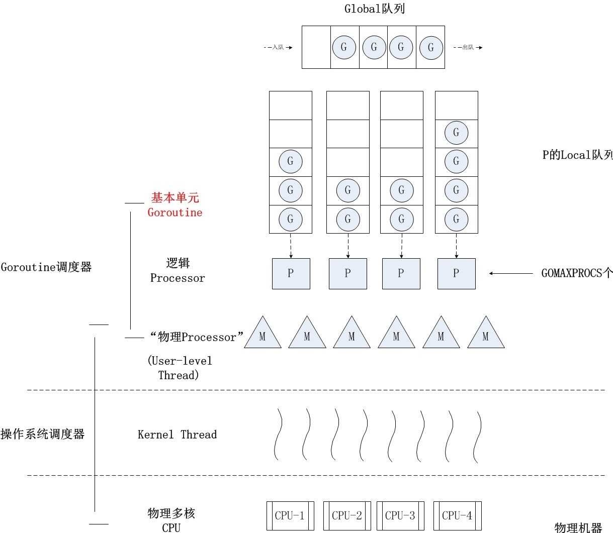

# Concurrency in Go


---

## 并发的产生？

CPU 计算 vs I/O：

| Operation                  | time  |
| -------------------------- | ----- |
| 2.5GHz的CPU一个时钟周期    | 0.4ns |
| 1Gbps的网络传输2KB数据时间 | 20μs  |
| SSD随机读取时间            | 150μs |
| 磁盘寻道+旋转时间          | 15ms  |

---


---

## 并发的载体

### Process

独立的地址空间，内核态上下文切换

### Thread

内核态上下文切换，切换开销小一些

### Coroutine

用户态上下文切换

---

## Goroutine

栈轻量、可扩缩容（2KB ~ 1GB）

由用户态线程调度

---

## Goroutine的调度 - GMP模型



---

## 并发从入门到放弃 - Race Condition

>计算机中的两个进程同时试图修改一个共享内存的内容，在没有并发控制的情况下，最后的结果依赖于两个进程的执行顺序与时机。而且如果发生了并发访问冲突，则最后的结果是不正确的。(Wikipedia)

---

## 并发从入门到放弃 -（1）丧失原子性

```go
var sum int64

func main() {
    for i := 0; i < 1000; i++ {
        go func() {
            sum++
        }()
    }

    fmt.Println(sum)
}
```

---

## 并发从入门到放弃 -（2）丧失顺序性

```go
func f1() {
    fmt.Print(1)
}

func f2() {
    fmt.Print(2)
}

func f3() {
    fmt.Print(3)
}

func main() {
    go f1()
    go f2()
    go f3()
}
```

---

## 并发从入门到放弃 - (3) 丧失可见性

```go
var s string

func hello() {
    s = "hello"
}

func main() {
    go hello()
    fmt.Print(s)
}
```

---

## 原子性、顺序性、可见性都丧失了，还编个JB？

---

## Race检查

## Concurrency Primitive

* Sync - Mutex & Atomic

* CSP模型 - Channel
  > CSP 是 Communicating Sequential Process 的简称，中文可以叫做通信顺序进程，是一种并发编程模型，是一个很强大的并发数据模型，是上个世纪七十年代提出的，用于描述两个独立的并发实体通过共享的通讯 channel(管道)进行通信的并发模型。相对于Actor模型，CSP中channel是第一类对象，它不关注发送消息的实体，而关注与发送消息时使用的channel。
  > Do not communicate by sharing memory; instead, share memory by communicating. ——Effective Go

---

## 拯救刚才的例子 - (1) 原子性

### sync/atomic

```go
atomic.AddInt64(&sum, 1)
```

### sync.Mutex

```go
var mx sync.Mutex

mx.Lock()
sum++
mx.Unlock()
```

---

## 拯救刚才的例子 - (2) 顺序性

```go
func f1() {
    fmt.Print(1)
    ch1 <- 1
}

func f2() {
    <- ch1
    fmt.Print(2)
    ch2 <- 2
}

func f3() {
    <- ch2
    fmt.Print(3)
    ch3 <- 3
}
```

---

## 拯救刚才的例子 - (3) 可见性

```go
func hello() {
    s = "hello"
    ch <- 1
}

func main() {
    go hello()
    <- ch
    fmt.Print(s)
}
```

---

## Understanding Real-World Concurrency Bugs in Go

---


---


---

## Blocking Bugs


---

* Kubernetes


---

* Docker#25384


---

* context

```go
hctx, hcancel := context.WithCancel(ctx)
if timeout > 0 {
    //hcancel.Cancel()
    hctx, hcancel = context.WithTimeout(ctx, timeout)
}
```

---


---

## Non-Blocking Bugs


---

* Docker


---

* etcd


---

* Docker


